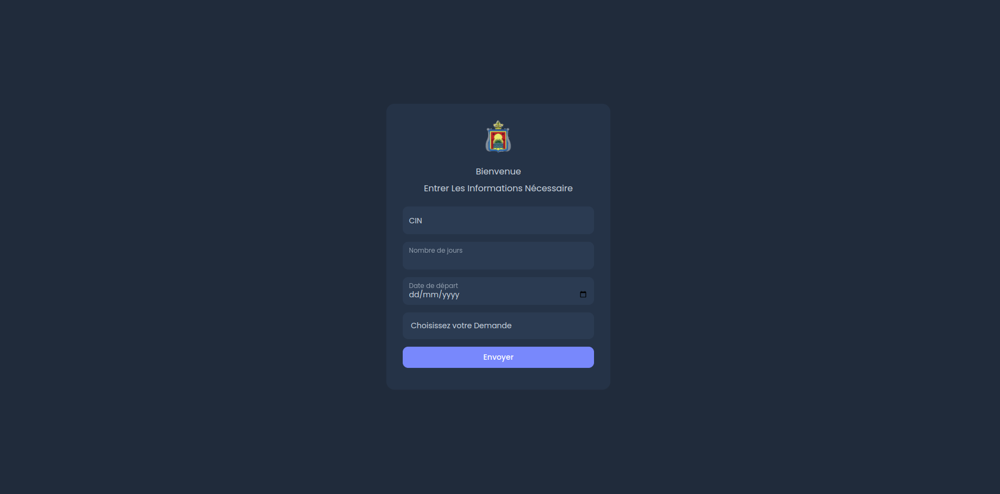
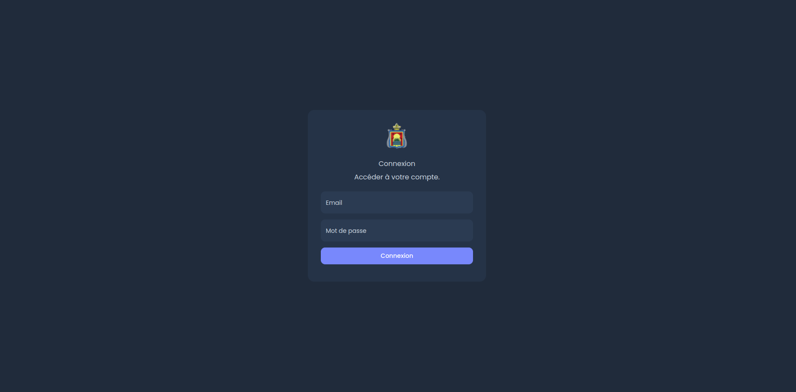
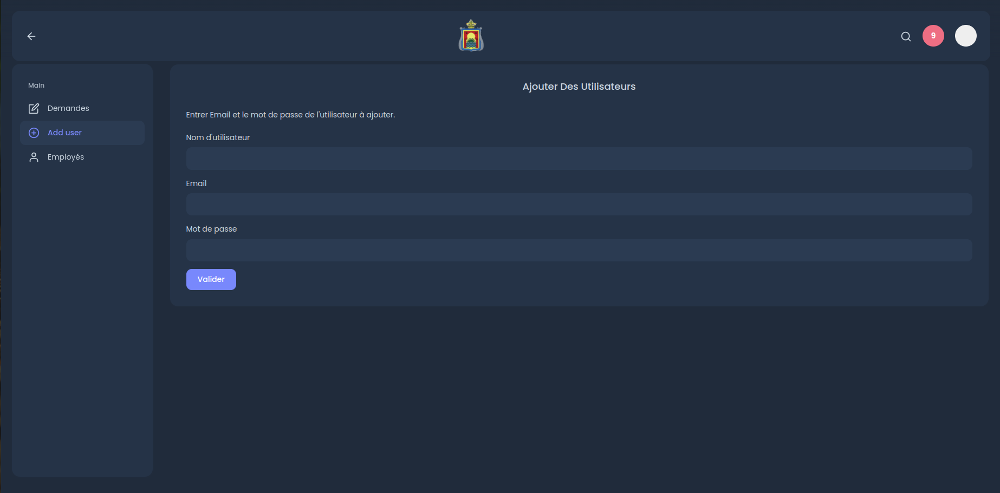
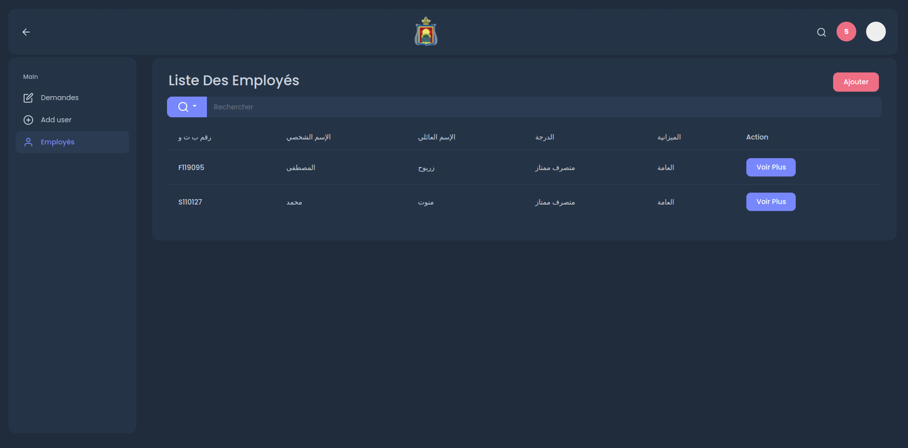
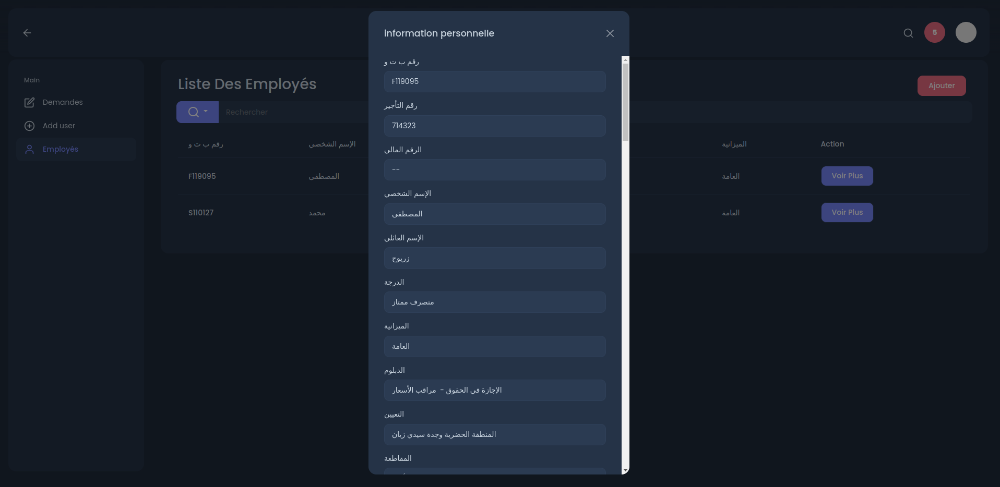

# Project Demo

<br>

<br>

<br>

<br>

<br>

<br>

<br>

<br>

<br>


## Getting Started

These instructions will get you a copy of the project up and running on your local machine for development and testing purposes.

### Prerequisites

NPM / Yarn and Node.js installed

### Installing

Installing NPM modules on both public and server folders

Execute this command in the project directory


```
cd server && npm install
```

### Running the app

Open a terminal on server directory

```
npm start
```


Access the web app at http://localhost:3000/

### Login the app

Go following link http://localhost:3000/login.html to acces your account 

<h4>Admin</h4>
email:

```
admin@gmail.com
```

password:

```
admin123
```

<h4>user</h4>
email:

```
user@gmail.com
```

password:

```
user123
```
